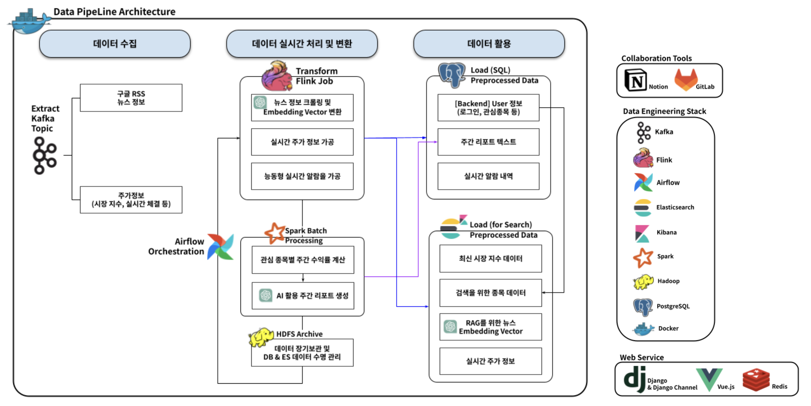
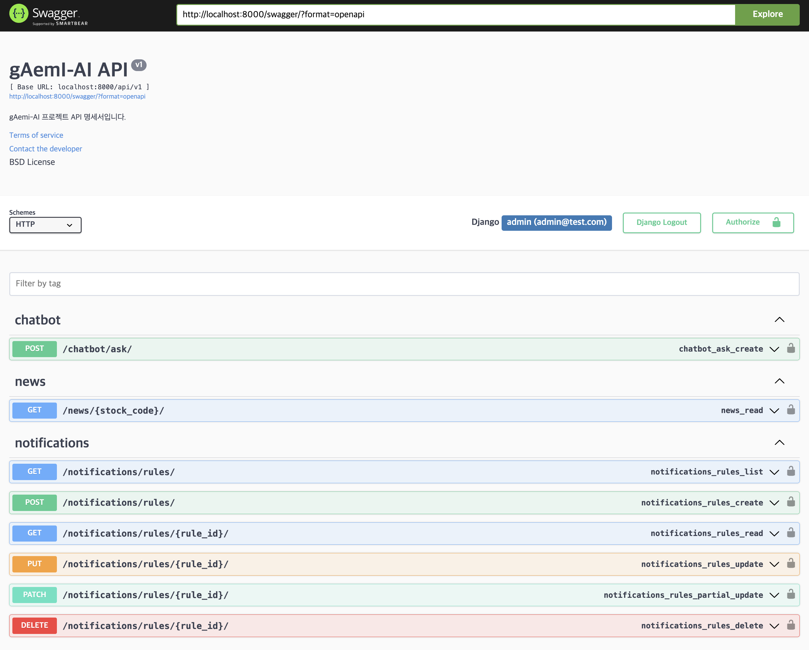
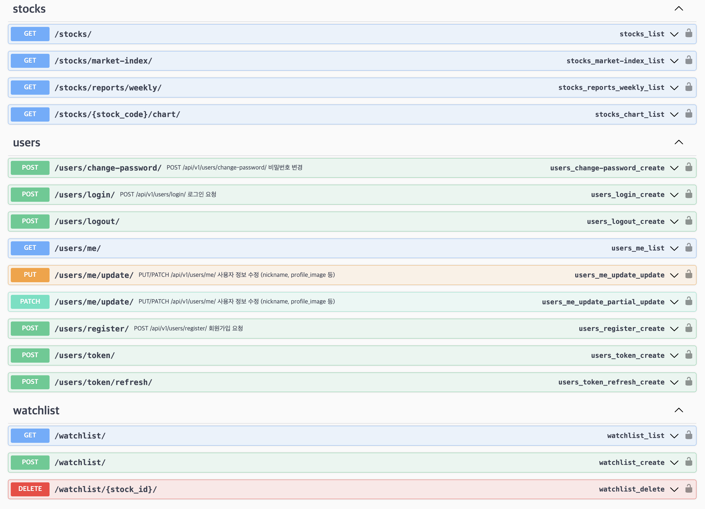
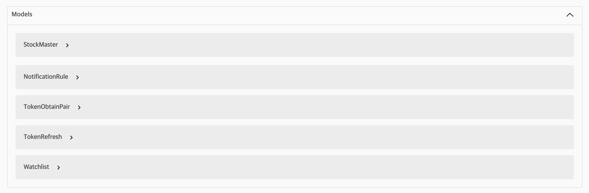

# 🐜 gAemI-AI
> **Big Data & GenAI 기반의 개인 맞춤형 주식 투자 리포트 플랫폼**
실시간 증권 데이터 파이프라인을 활용한 증권 전문 AI 챗봇 (**AI 뉴스 분석**, **능동형 알림**) 서비스 레파지토리입니다.

### 📌 Git 협업 전략
- [Branch 전략](https://www.notion.so/Branch-2d40c3d3c9ea8031b991fa5ef255b1cd?source=copy_link)

### 📌 활용 서비스 출처
- [한국투자증권 OPEN API](https://apiportal.koreainvestment.com/intro)

## 📖 1. 프로젝트 소개

**"정보의 홍수 속에서 개미 투자자들에게 간단하고 쉽게 '인사이트'를 제공할 수 없을까?"**

**gAemI-AI**는 초단위로 쏟아지는 주가 데이터와 뉴스 데이터를 실시간으로 수집·분석하여 사용자에게 **AI 요약 뉴스**와 **주간 투자 리포트** 그리고 **신뢰할 수 있는 AI 챗봇 답변**을 제공하는 서비스입니다.

### 🎯 기획 의도 및 해결 과제
* **데이터의 시각화 및 인사이트:** 단순한 차트 나열을 넘어, **Apache Spark**로 분석한 대용량 데이터를 **GenAI(LLM)** 가 알기 쉬운 문장으로 풀어 설명합니다.
* **시간이 부족한 개미 중 개미들을 위한 서비스**: 장기 투자를 목적으로 안정 주식을 **특정 가격**에 구매할 수 있도록 사용자 지정 조건에 맞춰 능동형 알람을 제공합니다.
* **확장 가능한 아키텍처:** 실시간 처리(Real-time)와 배치 처리(Batch)가 결합된 **Lambda Architecture**를 구축하여 대용량 트래픽에 대응했습니다.
* **도메인 특화 AI 챗봇**: 일반적 대답을 잘하는 General 모델에 증권이라는 도메인에 특화될 수 있도록 RAG(Retrieval-Augmented Generation) AI 챗봇을 제공합니다.

### ✨ 주요 기능
1.  **실시간 AI 뉴스 브리핑:** 뉴스가 뜨자마자 **Flink & OpenAI**가 3줄 요약 및 감성 분석(호재/악재) 수행
2.  **주간 맞춤 리포트:** 매주 토요일, 나의 관심 종목에 대한 지난주 주가 흐름과 이슈를 **Spark & LLM**이 종합 분석하여 리포트 발행
3.  **실시간 시장 지수 & 차트:** **WebSocket**과 **Redis** 캐싱을 활용한 지연 없는 실시간 데이터 스트리밍 & 알림

## 🏗️ 2. 시스템 아키텍처 

### 💡 기술적 의사결정
* **Lambda Architecture:** 실시간성(Flink)과 정확성(Spark)을 모두 잡기 위해 속도 계층과 배치 계층을 분리
* **Container Isolation:** 의존성 충돌 방지와 개별 확장을 위해 Kafka, Spark, Backend, Frontend 등 모든 컴포넌트를 **Docker Container**로 격리
* **Vector Search:** 뉴스 검색 및 RAG 구현을 위해 Elasticsearch의 벡터 검색 기능 활용

## 🛠️ 3. 기술 스택

| Category | Technologies |
| :--- | :--- |
| **Frontend** | Vue.js, Axios, Chart.js|
| **Backend** | Django REST Framework |
| **Data Ingestion** | Apache Kafka, Zookeeper, Python Crawlers |
| **Stream Processing** | Apache Flink, Elasticsearch (Vector Store) |
| **Batch Processing** | Apache Spark, Hadoop (HDFS), Airflow (Scheduling) |
| **Database & Cache** | PostgreSQL, Redis |
| **AI** | OpenAI API |
| **DevOps** | Docker, Docker Compose, Nginx |

## ✨ 4. 기술개발문서
**[Data Engineering]**
- [중복방지를 위한 2단계 방어선 구축! In-Memory Filtering + Kafka Log Compaction](https://www.notion.so/2-In-Memory-Filtering-Kafka-Log-Compaction-2c00c3d3c9ea802eb722e7f050803e6c?source=copy_link)
- [Flink 알림 시스템: 이상(Broadcast)과 현실의 간극 좁히기](https://www.notion.so/Flink-Broadcast-2cc0c3d3c9ea80cca4efdd88189fbc67?source=copy_link)
- [주식 캔들 차트: 시간 축의 불연속성을 선택한 기술적 배경](https://www.notion.so/2cd0c3d3c9ea807bbe58de48840eba98?source=copy_link)
- [Kafka → Elasticsearch Index Consumer 설계 및 구현 배경](https://www.notion.so/Kafka-Elasticsearch-Index-Consumer-2cf0c3d3c9ea8068a0ede8a2d90a6a6c?source=copy_link)

**[Backend & Frontend]**
- [WebSocket 기반 실시간 시세 및 알림 파이프라인](https://www.notion.so/WebSocket-2cf0c3d3c9ea8016b0b9f67bd3709bf2?source=copy_link)
- [[Frontend] 사용자 인증 & 상태 관리 설계](https://www.notion.so/Frontend-2d40c3d3c9ea8011b8b1f5097657441d?source=copy_link)
- [[Frontend] Backend 통신 아키텍처에 대한 Frontend 수용 및 한계 인지](https://www.notion.so/Frontend-Backend-Frontend-REST-API-WebSocket-2d40c3d3c9ea80eca1eee852073e01b0?source=copy_link)
- [[Frontend] 실시간 UI 처리 구조 (WebSocket 이벤트 수용)](https://www.notion.so/Frontend-UI-WebSocket-2d40c3d3c9ea805db15aff70fd2a7196?source=copy_link)

**[Infa & Data Governance]**
- [데이터 거버넌스 및 수명주기 관리 전략](https://www.notion.so/2cf0c3d3c9ea80a1b5e7f533f9b0ce1e?source=copy_link)

**[ETC]**
- [왜 Google RSS를 사용했나요?](https://www.notion.so/Google-RSS-2c00c3d3c9ea803ca500d5374af9cdc1?source=copy_link)
- [왜 기사 전체 내용을 Embedding 변환하지 않았나요?](https://www.notion.so/Embedding-2c60c3d3c9ea8049b09af74c3625ebe4?source=copy_link)
- [Frontend 추후 개선 계획](https://www.notion.so/Frontend-2d40c3d3c9ea80fdae5fe9d64070d97a?source=copy_link)

## 📚 5. 상세 가이드 및 구조

프로젝트의 폴더 구조, 설치 방법, 환경 변수 설정 등 상세한 실행 가이드는 아래 문서를 참고해주세요.

👉 **[프로젝트 실행 가이드 및 폴더 구조 상세 보기](USAGE_AND_STRUCTURE.md)**

## 🔌 6. API 명세서 

Websocket 백엔드 API 엔드포인트에 대한 상세 명세는 아래 링크에서 확인하실 수 있습니다.

* **Swagger**: localhost:8000/swagger/
* **Websocket API Docs:** [노션 문서 바로가기](https://www.notion.so/WebSocket-API-2cf0c3d3c9ea80019b96ec13235b6ef0?source=copy_link)

## 📝 7. 발표 자료 
* **발표 자료 (PDF):** [Google Drive 바로가기](https://drive.google.com/file/d/1KriCaHfVkuzNpuEkzactITgf2cVqcHgd/view?usp=sharing)
