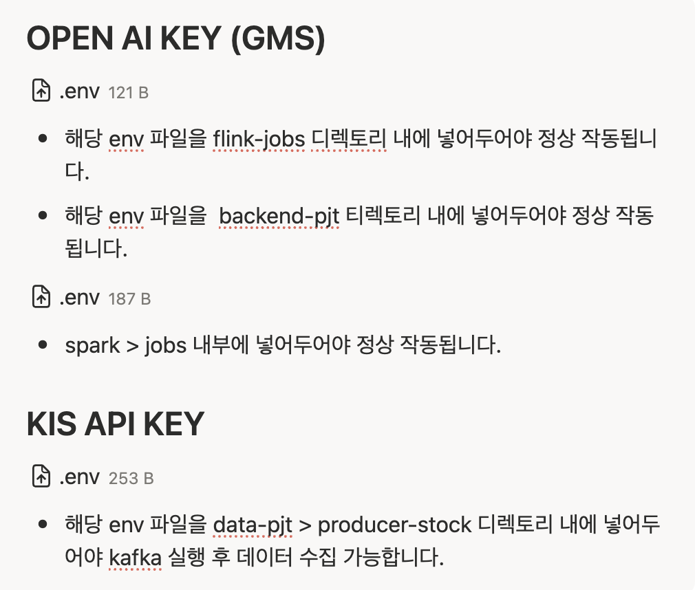

# 📚 프로젝트 구조 및 실행 가이드 

이 문서는 **gAemI-AI** 프로젝트의 설치, 실행, 그리고 데이터 파이프라인 구동 방법에 대해 상세히 기술합니다.

## 📂 1. 폴더 구조 

```bash
gAemI-AI/
├── backend-pjt/            # Django REST Framework (API Server)
│   ├── gaemi_backend/      # 프로젝트 설정 (Settings)
│   ├── stocks/             # 주식/리포트 관련 앱
│   ├── news/               # 뉴스 데이터 관련 앱
│   ├── chatbot/            # AI 챗봇 관련 앱
│   ├── notifications/      # 알림 관련 앱
│   ├── users/              # 사용자 인증/관리 앱
│   └── watchlist/          # 관심 종목 관리 앱
│
├── frontend-pjt/           # Vue.js 3 (Web Client)
│   ├── src/                # Vue 컴포넌트 및 로직
│   ├── public/             # 정적 파일
│   └── vite.config.js      # Vite 설정
│
├── data-pjt/               # 데이터 파이프라인 (Big Data)
│   ├── producer-stock/     # 주가 데이터 생성 및 Kafka 전송
│   ├── producer-news/      # 뉴스 데이터 생성 및 Kafka 전송
│   ├── flink/              # Flink Cluster 설정
│   ├── flink-jobs/         # 실시간 데이터 처리 로직 (Java/Python)
│   ├── spark/              # Spark 배치 작업 스크립트 (Weekly Report)
│   ├── airflow/            # 워크플로우 스케줄링 DAGs
│   └── consumer-index/     # 시장 지수 처리 컨슈머
│
├── config/                 # 인프라 설정 파일
│   └── postgres/           # DB 초기화 스크립트 등
│
├── docker-compose.yml      # 전체 컨테이너 오케스트레이션 설정
└── README.md

```

---

## ⚙️ 2. 필수 환경 설정

프로젝트 실행 전 로컬 환경에 아래 도구들이 설치되어 있어야 합니다.

* **Docker** & **Docker Compose**
* **Git**

### 환경 변수 (.env) 설정

아래 경로에 `.env` 파일을 생성해야합니다.


---

## 🚀 3. 설치 및 실행 

반드시 아래 순서대로 진행해 주세요.

### Step 1. 컨테이너 빌드 및 실행

프로젝트 루트 폴더에서 Docker Compose를 실행합니다. 모든 서비스가 빌드되고 구동될 때까지 잠시 기다려주세요.

```bash
# 백그라운드 모드로 실행
docker-compose up -d --build

```

### Step 2. Frontend 의존성 설치 (필수)

초기 실행 시 라이브러리가 누락될 수 있으므로, **`marked` 라이브러리** 및 기타 의존성을 컨테이너 내부에서 설치해야 합니다.

```bash
# 1. Frontend 컨테이너 접속
docker exec -it gaemi_frontend /bin/sh

# 2. 패키지 설치 (내부 터미널에서 입력)
npm install
npm install marked

# 3. 컨테이너 나가기
exit

# 4. (선택) Frontend 컨테이너만 재시작
docker-compose restart frontend

```

### Step 3. Backend 데이터베이스 마이그레이션 (필수)

데이터베이스 테이블을 생성하고 초기 관리자 계정을 생성합니다.

```bash
# 1. Backend 컨테이너 접속
docker exec -it gaemi_backend /bin/bash

# 2. 마이그레이션 수행 (DB 테이블 생성)
python manage.py makemigrations
python manage.py migrate

# 4. 컨테이너 나가기
exit

```

---


- 시스템이 켜져 있어도 데이터가 없으면 화면이 비어 보입니다. (장 마감 시간)


### Step 3. 주간 리포트 생성 (Spark Batch Job)

일주일 치 데이터를 분석하여 리포트를 생성하는 Spark 작업을 **수동으로 즉시 실행**가능합니다.

```bash
# Spark Master 컨테이너에 명령 전달
docker exec gaemi_spark_master /opt/spark/bin/spark-submit \
  --master spark://spark-master:7077 \
  --jars /opt/spark/jars/postgresql-42.7.2.jar,/opt/spark/jars/elasticsearch-spark-30_2.12-8.11.1.jar \
  /opt/spark/jobs/weekly_report_job.py

```

> **성공 확인:** 실행 후 콘솔에 에러가 없고, 웹 페이지의 "주간 리포트" 탭에 AI 요약 데이터가 보이면 성공입니다.

---

## 🌐 5. 서비스 접속 주소

| 서비스 | 주소 | 비고 |
| --- | --- | --- |
| **Frontend** | [http://localhost:3000](https://www.google.com/search?q=http://localhost:3000) | 메인 웹 서비스 |
| **Backend API** | [http://localhost:8000/api/v1/](https://www.google.com/search?q=http://localhost:8000/api/v1/) | API 서버 |
| **Django Admin** | [http://localhost:8000/admin/](https://www.google.com/search?q=http://localhost:8000/admin/) | 데이터 관리자 페이지 |
| **Spark Master** | [http://localhost:8080](https://www.google.com/search?q=http://localhost:8080) | Spark 클러스터 상태 확인 |
| **Kibana** | [http://localhost:5601](https://www.google.com/search?q=http://localhost:5601) | 로그 및 데이터 시각화 |